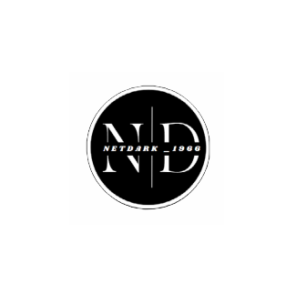

# 📄 PDF OCR Studio

## ℹ️ Opis projektu

**PDF OCR Studio** to aplikacja webowa zbudowana w technologii **Streamlit**, służąca do konwersji plików PDF do przeszukiwalnego tekstu z wykorzystaniem technologii OCR (Tesseract). Oferuje tłumaczenie z języka angielskiego na polski, podgląd miniatur stron, wybór zakresu stron, eksport do formatów **TXT, DOCX, PDF**, wyświetlanie metadanych dokumentu oraz prowadzenie historii konwersji. Projekt utrzymuje spójny i nowoczesny **ciemny motyw** z brandingiem *netdark_1966*.

---

## ✨ Funkcje

- 📥 **Wgrywanie PDF** i podgląd miniaturek stron
- 🔍 **OCR (Optical Character Recognition)** z wielojęzycznym wsparciem
- 🌐 **Tłumaczenie EN → PL** (deep_translator / Google Translate API)
- 🈶 **Auto-wykrywanie języka** w dokumencie
- 📋 **Wyświetlanie metadanych PDF** (tytuł, autor, data utworzenia, itp.)
- 💾 **Eksport wyników** do TXT, DOCX i PDF
- 🗂 **Historia konwersji** z możliwością czyszczenia
- 🎨 **Ciemny motyw** i nowoczesny interfejs użytkownika

## 🔧 Instalacja

### Wymagania wstępne

1. Python 3.8 lub nowszy
2. Tesseract OCR zainstalowany w systemie

### Instalacja Tesseract OCR

#### Windows

```bash
winget install -e --id UB-Mannheim.TesseractOCR
```

lub pobierz z [oficjalnej strony](https://github.com/UB-Mannheim/tesseract/wiki)

#### Linux (Ubuntu/Debian)

```bash
sudo apt-get update
sudo apt-get install tesseract-ocr
sudo apt-get install tesseract-ocr-pol tesseract-ocr-eng
```

### Instalacja aplikacji

1. Sklonuj repozytorium:

```bash
git clone https://github.com/Darek1966/PDF_OCR_Studio.git
cd PDF_OCR_Studio
```

2. Zainstaluj wymagane biblioteki:

```bash
pip install -r requirements.txt
```

3. Uruchom aplikację:

```bash
streamlit run app.py
```

## 📋 Użycie

1. Wgraj plik PDF za pomocą przycisku w lewym panelu
2. Zaznacz strony do przetworzenia
3. Wybierz opcje OCR i tłumaczenia
4. Kliknij "🚀 Uruchom OCR" i poczekaj na zakończenie procesu
5. Pobierz wyniki w wybranym formacie (TXT, DOCX, PDF)
6. Przeglądaj metadane dokumentu w panelu bocznym

## 🧰 Technologie

* **Python** - język programowania
* **Streamlit** - framework do tworzenia aplikacji webowych
* **PyMuPDF (fitz)** - biblioteka do obsługi plików PDF
* **Tesseract OCR** - silnik OCR do rozpoznawania tekstu
* **pytesseract** - wrapper Pythona dla Tesseract
* **deep_translator** - biblioteka do tłumaczenia tekstu
* **langdetect** - biblioteka do wykrywania języka
* **python-docx** - tworzenie dokumentów DOCX
* **reportlab** - generowanie plików PDF
* **PIL/Pillow** - przetwarzanie obrazów

## 📁 Struktura projektu

```
PDF_OCR_Studio/
├── app.py
├── requirements.txt
├── .streamlit/
│   └── config.toml
├── assets/
│   ├── icon.png
│   └── logo.png
├── history/
│   └── conversions.json   # tworzony automatycznie
├── output/                # tworzony automatycznie
└── README.md
```

## 🤝 Współpraca

Jeśli chcesz przyczynić się do rozwoju projektu:

1. Utwórz fork repozytorium
2. Stwórz nową gałąź dla swojej funkcji (`git checkout -b feature/amazing-feature`)
3. Zatwierdź zmiany (`git commit -m 'Dodano nową funkcję'`)
4. Wypchnij do gałęzi (`git push origin feature/amazing-feature`)
5. Otwórz Pull Request

## 📜 Licencja

Ten projekt jest udostępniany na licencji MIT. Szczegółowe informacje znajdują się w pliku LICENSE.

## 📞 Kontakt

<div style="display: flex; align-items: center; gap: 15px;">
  
  <div style="display: flex; align-items: center; gap: 10px;">
    <span>netdark_1966</span>
    <svg width="16" height="16" viewBox="0 0 24 24" fill="currentColor">
      <path d="M20 4H4c-1.1 0-1.99.9-1.99 2L2 18c0 1.1.9 2 2 2h16c1.1 0 2-.9 2-2V6c0-1.1-.9-2-2-2zm0 4l-8 5-8-5V6l8 5 8-5v2z"/>
    </svg>
    <a href="mailto:netdark_1966@op.pl">netdark_1966</a>
    <svg width="16" height="16" viewBox="0 0 24 24" fill="currentColor">
      <path d="M12 0c-6.626 0-12 5.373-12 12 0 5.302 3.438 9.8 8.207 11.387.599.111.793-.261.793-.577v-2.234c-3.338.726-4.033-1.416-4.033-1.416-.546-1.387-1.333-1.756-1.333-1.756-1.089-.745.083-.729.083-.729 1.205.084 1.839 1.237 1.839 1.237 1.07 1.834 2.807 1.304 3.492.997.107-.775.418-1.305.762-1.604-2.665-.305-5.467-1.334-5.467-5.931 0-1.311.469-2.381 1.236-3.221-.124-.303-.535-1.524.117-3.176 0 0 1.008-.322 3.301 1.23.957-.266 1.983-.399 3.003-.404 1.02.005 2.047.138 3.006.404 2.291-1.552 3.297-1.23 3.297-1.23.653 1.653.242 2.874.118 3.176.77.84 1.235 1.911 1.235 3.221 0 4.609-2.807 5.624-5.479 5.921.43.372.823 1.102.823 2.222v3.293c0 .319.192.694.801.576 4.765-1.589 8.199-6.086 8.199-11.386 0-6.627-5.373-12-12-12z"/>
    </svg>
    <a href="https://github.com/Darek1966">GitHub — Darek1966</a>
  </div>
</div>

---
